# Qualitative Results

## Iconography Style

### Case: Pandas

**Prompt:** a panda rowing a boat in a pond. <br/>
**Style:** iconography <br/>
**Preview:**

| 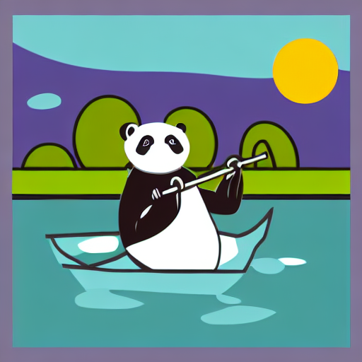 |  |  |
|-------------------------------------------------------------------------------|-----------------------------------------------------------------------------|---------------------------------------------------------------------------------|
| (a) Sample raster image with Stable Diffusion                                 | (b) Convert raster image to a vector via LIVE                               | (c) VectorFusion: Fine tune by LSDS                                             |

**Script:**

```shell
python run_painterly_render.py -c vectorfusion.yaml -pt "a panda rowing a boat in a pond. minimal flat 2d vector icon. lineal color. on a white background. trending on artstation" -save_step 50 -respath ./workdir/pandas -d 294308
```

### Case: Starbucks

**Prompt:** A Starbucks coffee. <br/>
**Style:** iconography <br/>
**Preview:**

| 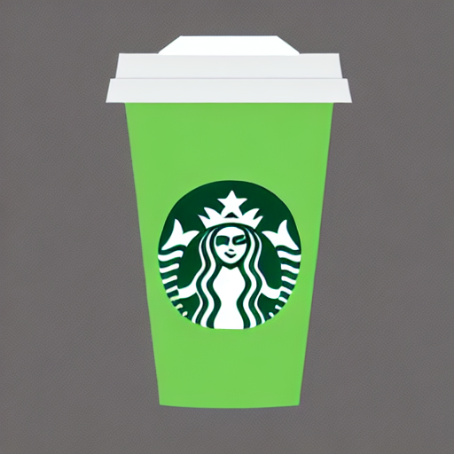 | 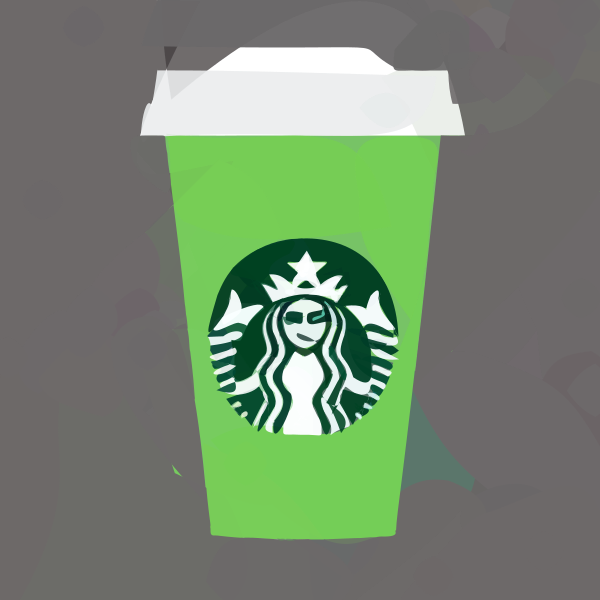 | 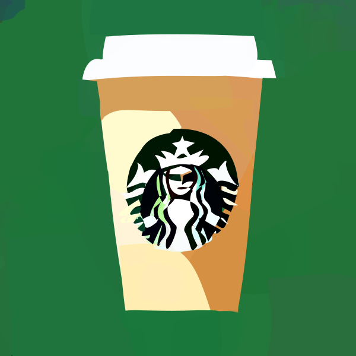 |
|----------------------------------------------------------------------------------|--------------------------------------------------------------------------------|------------------------------------------------------------------------------------|
| (a) Sample raster image with Stable Diffusion                                    | (b) Convert raster image to a vector via LIVE                                  | (c) VectorFusion: Fine tune by LSDS                                                |

**Script:**

```shell
python run_painterly_render.py -c vectorfusion.yaml -pt "A Starbucks coffee. minimal flat 2d vector icon. lineal color. on a white background. trending on artstation" -save_step 50 -respath ./workdir/starbucks -d 367022
```

### Case: Sloth

**Prompt:** A smiling sloth wearing a leather jacket, a cowboy hat and a kilt. <br/>
**Style:** iconography <br/>
**Preview:**

|  |  |  |
|------------------------------------------------------------------------------|----------------------------------------------------------------------------|--------------------------------------------------------------------------------|
| (a) Sample raster image with Stable Diffusion                                | (b) Convert raster image to a vector via LIVE                              | (c) VectorFusion: Fine tune by LSDS                                            |

**Script:**

```shell
python run_painterly_render.py -c vectorfusion.yaml -pt "A smiling sloth wearing a leather jacket, a cowboy hat and a kilt. minimal flat 2d vector icon. lineal color. on a white background. trending on artstation" -save_step 50 -respath ./workdir/sloth -d 280328 
```

### Case: Owl

**Prompt:** an owl standing on a wire. <br/>
**Style:** iconography <br/>
**Preview:**

| 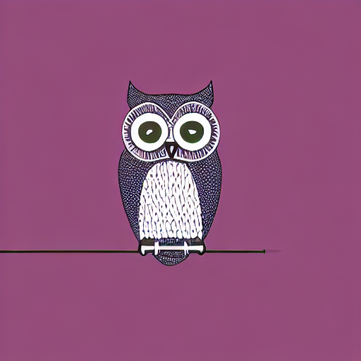 | 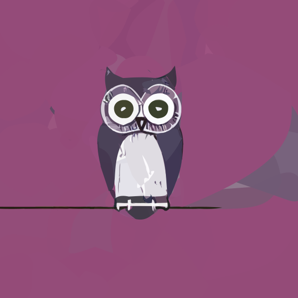 | 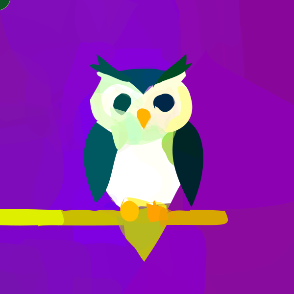 |
|----------------------------------------------------------------------------|--------------------------------------------------------------------------|------------------------------------------------------------------------------|
| (a) Sample raster image with Stable Diffusion                              | (b) Convert raster image to a vector via LIVE                            | (c) VectorFusion: Fine tune by LSDS                                          |

**Script:**

```shell
python run_painterly_render.py -c vectorfusion.yaml -pt "an owl standing on a wire. minimal flat 2d vector icon. lineal color. on a white background. trending on artstation" -save_step 50 -respath ./workdir/owl -d 857581 
```

### Case: Train

**Prompt:** a train. <br/>
**Style:** iconography <br/>
**Preview:**

| 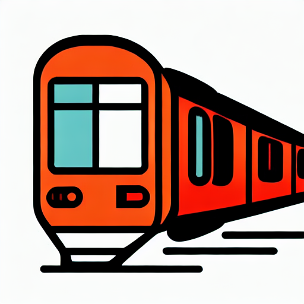 | 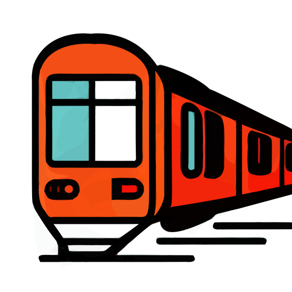 | 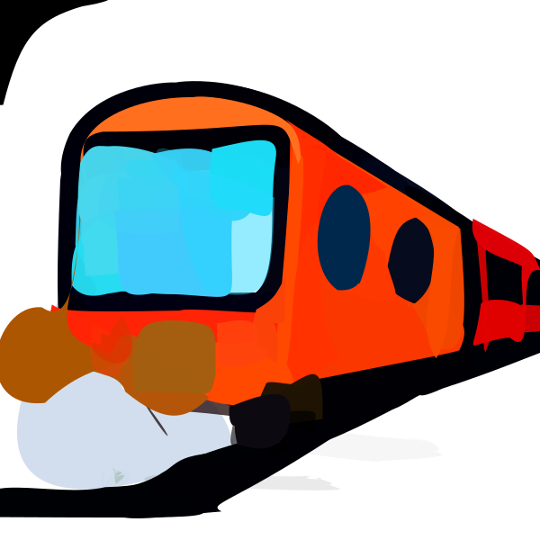 |
|------------------------------------------------------------------------------|----------------------------------------------------------------------------|--------------------------------------------------------------------------------|
| (a) Sample raster image with Stable Diffusion                                | (b) Convert raster image to a vector via LIVE                              | (c) VectorFusion: Fine tune by LSDS                                            |

**Script:**

```shell
python run_painterly_render.py -c vectorfusion.yaml -pt "a train. minimal flat 2d vector icon. lineal color. on a white background. trending on artstation" -save_step 50 -respath ./workdir/train -d 857581 
```

### Case: Fire

**Prompt:** fire. <br/>
**Style:** iconography <br/>
**Preview:**

| 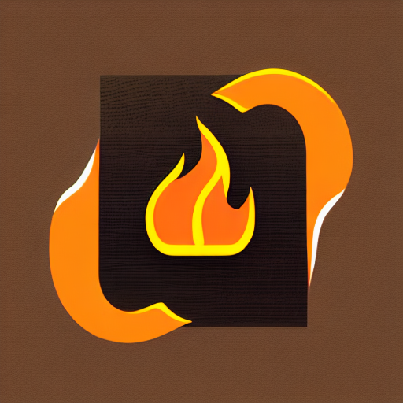 | 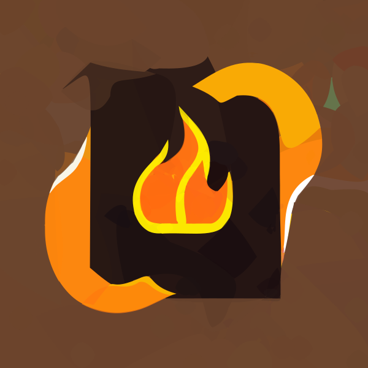 | 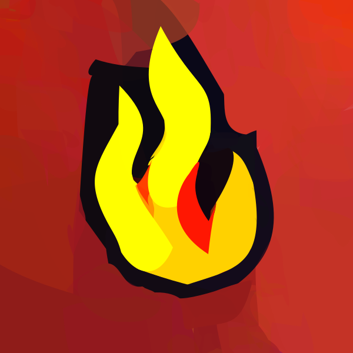 |
|-----------------------------------------------------------------------------|---------------------------------------------------------------------------|-------------------------------------------------------------------------------|
| (a) Sample raster image with Stable Diffusion                               | (b) Convert raster image to a vector via LIVE                             | (c) VectorFusion: Fine tune by LSDS                                           |

**Script:**

```shell
python run_painterly_render.py -c vectorfusion.yaml -pt "fire. minimal flat 2d vector icon. lineal color. on a white background. trending on artstation" -save_step 50 -respath ./workdir/fire -d 1452 
```

---

## Pixel-Art Style

### Case: Guitar

**Prompt:** Electric guitar. <br/>
**Style:** Pixel-Art <br/>
**Preview:**

| 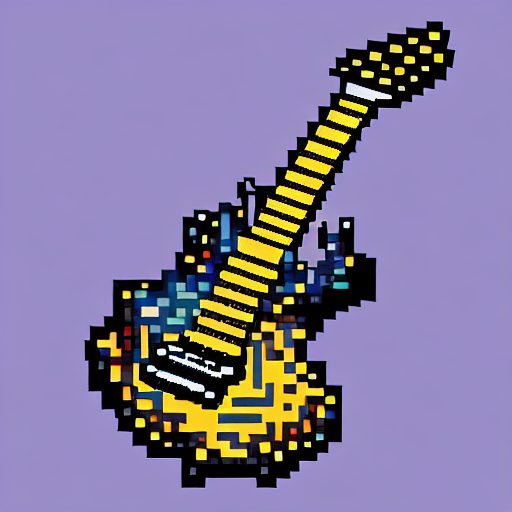 | 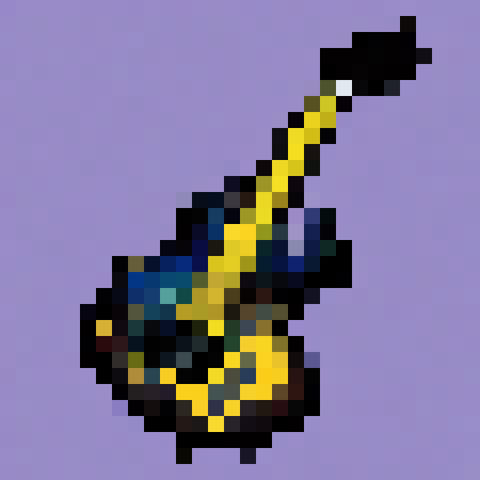 |  |
|----------------------------------------------------------------------------------|--------------------------------------------------------------------------------|------------------------------------------------------------------------------------|
| (a) Sample raster image with Stable Diffusion                                    | (b) Convert raster image to a vector via LIVE                                  | (c) VectorFusion: Fine tune by LSDS                                                |

**Script:**

```shell
python run_painterly_render.py -c vectorfusion.yaml -pt "Electric guitar. pixel art. trending on artstation" -save_step 50 -respath ./workdir/guitar -update "style=pixelart" -d 428484  
```

### Case: Hamburger

**Prompt:** A delicious hamburger. <br/>
**Style:** Pixel-Art <br/>
**Preview:**

|  |  | 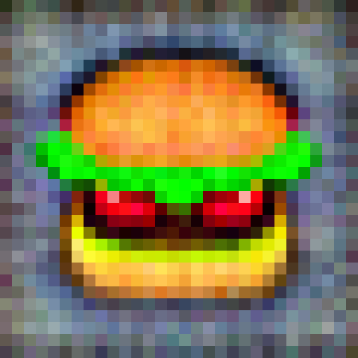 |
|-----------------------------------------------------------------------------------|---------------------------------------------------------------------------------|-------------------------------------------------------------------------------------|
| (a) Sample raster image with Stable Diffusion                                     | (b) Convert raster image to a vector via LIVE                                   | (c) VectorFusion: Fine tune by LSDS                                                 |

**Script:**

```shell
python run_painterly_render.py -c vectorfusion.yaml -pt "A delicious hamburger. pixel art. trending on artstation" -save_step 50 -respath ./workdir/hamburger -update "style=pixelart" -d 499578
```

### Case: Pikachu

**Prompt:** Pikachu. <br/>
**Style:** Pixel-Art <br/>
**Preview:**

| 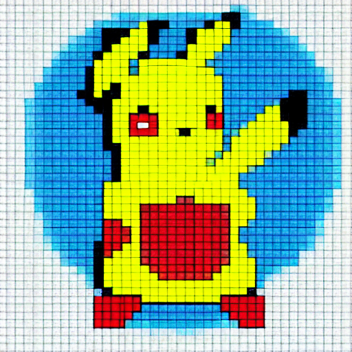 | 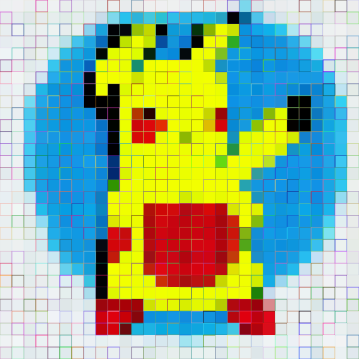 | 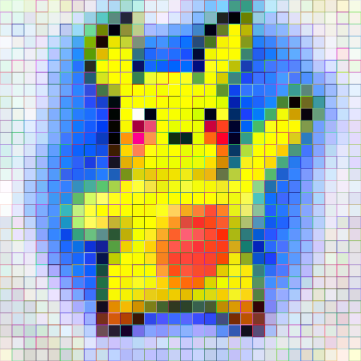 |
|---------------------------------------------------------------------------------|-------------------------------------------------------------------------------|-----------------------------------------------------------------------------------|
| (a) Sample raster image with Stable Diffusion                                   | (b) Convert raster image to a vector via LIVE                                 | (c) VectorFusion: Fine tune by LSDS                                               |

**Script:**

```shell
python run_painterly_render.py -c vectorfusion.yaml -pt "A delicious hamburger. pixel art. trending on artstation" -save_step 50 -respath ./workdir/hamburger -update "style=pixelart" -d 499578
```

---

## Sketch Style

### Case: Dragon

**Prompt:** watercolor painting of a firebreathing dragon. <br/>
**Style:** Sketch <br/>
**Preview:**

|  |  |  |
|-------------------------------------------------|---------------------------------------------------|------------------------------------------------|
| SVG initialization                              | VectorFusion fine-tune 500 step                   | VectorFusion fine-tune 1500 step               |

**Script:**

```shell
python run_painterly_render.py -c vectorfusion.yaml -pt "watercolor painting of a firebreathing dragon. minimal 2d line drawing. trending on artstation" -save_step 50 -respath ./workdir/dragon-sketch -update "style=sketch num_segments=5 radius=0.5 sds.num_iter=1500" -d 947593  
```

### Case: The Eiffel Tower

**Prompt:** The Eiffel Tower. <br/>
**Style:** Sketch <br/>
**Preview:**

|  |  |  |
|----------------------------------------------------|------------------------------------------------------|---------------------------------------------------|
| SVG initialization                                 | VectorFusion fine-tune 500 step                      | VectorFusion fine-tune 1500 step                  |

**Script:**

```shell
CUDA_VISIBLE_DEVICES=0 python run_painterly_render.py -c vectorfusion.yaml -pt "The Eiffel Tower. minimal 2d line drawing. trending on artstation" -save_step 50 -respath ./workdir/EiffelTower-sketch -update "style=sketch skip_live=True num_segments=5 radius=0.5 sds.num_iter=1500" -d 965058  
```

### Case: Temple

**Prompt:** A 3D rendering of a temple. <br/>
**Style:** Sketch <br/>
**Preview:**

|  |  |  |
|-----------------------------------------------|-------------------------------------------------|----------------------------------------------|
| SVG initialization                            | VectorFusion fine-tune 500 step                 | VectorFusion fine-tune 1500 step             |

**Script:**

```shell
python run_painterly_render.py -c vectorfusion.yaml -pt "A 3D rendering of a temple. minimal 2d line drawing. trending on artstation" -save_step 50 -respath ./workdir/temple-sketch -update "style=sketch num_segments=5 radius=0.5 sds.num_iter=1500" -d 809385  
```