# VectorFusion: Text-to-SVG by Abstracting Pixel-Based Diffusion Models

In this work, the authors show that a text-conditioned diffusion model trained on pixel representations of images can be
used to
generate SVG-exportable vector graphics.

> official website: https://vectorfusion.github.io/

## Updates

- [01/2024] 🔥 **We released the [SVGDreamer](https://ximinng.github.io/SVGDreamer-project/). SVGDreamer is
  a novel text-guided vector graphics synthesis method. This method considers both the editing of vector graphics and
  the quality of the synthesis.**
- [12/2023] 🔥 **We released the [PyTorch-SVGRender](https://github.com/ximinng/PyTorch-SVGRender). Pytorch-SVGRender is
  the go-to library for state-of-the-art differentiable rendering methods for image vectorization.**
- [10/2023] 🔥 **We released the [DiffSketcher code](https://github.com/ximinng/DiffSketcher). A method of synthesizing
  vector sketches by text prompts.**
- [10/2023] 🔥 We released the VectorFusion code.

## Installation

### Step by step

Create a new conda environment:

```shell
conda create --name vf python=3.10
conda activate vf
```

Install pytorch and the following libraries:

```shell
conda install pytorch==1.13.1 torchvision==0.14.1 torchaudio==0.13.1 pytorch-cuda=11.6 -c pytorch -c nvidia
pip install omegaconf BeautifulSoup4
pip install shapely
pip install opencv-python scikit-image matplotlib visdom wandb
pip install triton numba
pip install numpy scipy timm scikit-fmm einops
pip install accelerate transformers safetensors datasets
```

Install CLIP:

```shell
pip install ftfy regex tqdm
pip install git+https://github.com/openai/CLIP.git
```

Install diffusers:

```shell
pip install diffusers==0.20.2
```

Install xformers (require `python=3.10`):

```shell
conda install xformers -c xformers
```

Install diffvg:

```shell
git clone https://github.com/BachiLi/diffvg.git
cd diffvg
git submodule update --init --recursive
conda install -y -c anaconda cmake
conda install -y -c conda-forge ffmpeg
pip install svgwrite svgpathtools cssutils torch-tools
python setup.py install
```

### Docker Usage

```shell
docker run --name vectorfusion --gpus all -it --ipc=host ximingxing/svgrender:v1 /bin/bash
```

## Quickstart

### Case: Sydney Opera House

**Prompt:** the Sydney Opera House.<br/>
**Style:** iconography <br/>
**Preview:**

| 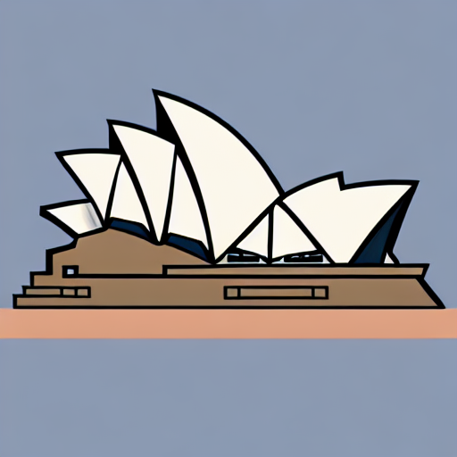 |  |  |
|-----------------------------------------------------------------------------------------|---------------------------------------------------------------------------------------|-------------------------------------------------------------------------------------------|
| (a) Sample raster image with Stable Diffusion                                           | (b) Convert raster image to a vector via LIVE                                         | (c) VectorFusion: Fine tune by LSDS                                                       |

**LIVE Rendering Process:**

|                        iter 0                         |                        iter 500                         |                        iter 1000                         |                        iter 1500                         | iter 2500                                                | iter 3500                                                |
|:-----------------------------------------------------:|:-------------------------------------------------------:|:--------------------------------------------------------:|:--------------------------------------------------------:|----------------------------------------------------------|----------------------------------------------------------|
| 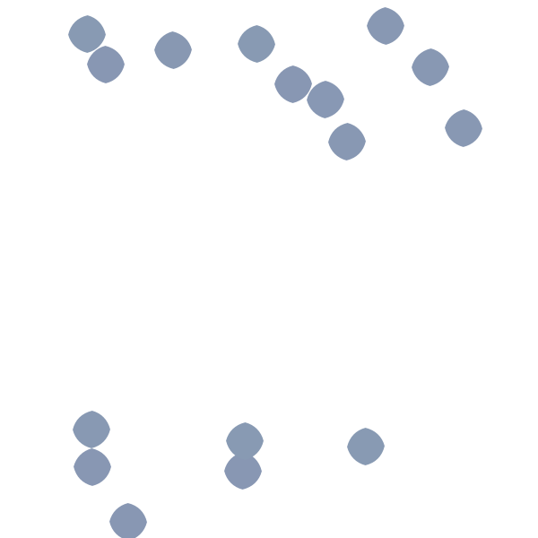 |  | 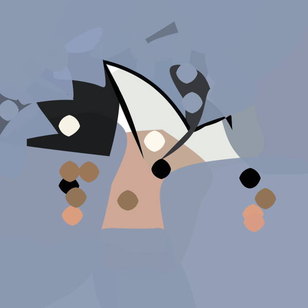 |  |  |  |

**VectorFusion Rendering Process:**

|                        iter 0                        |                        iter 100                        |                        iter 300                        |                        iter 400                        | iter 700                                               | iter 1000                                            |
|:----------------------------------------------------:|:------------------------------------------------------:|:------------------------------------------------------:|:------------------------------------------------------:|--------------------------------------------------------|------------------------------------------------------|
| 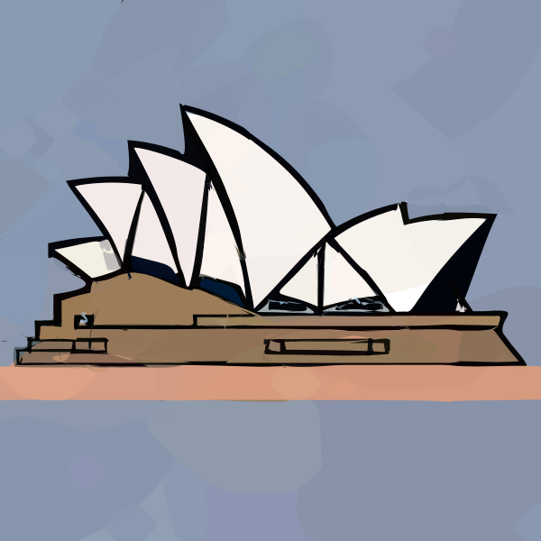 | 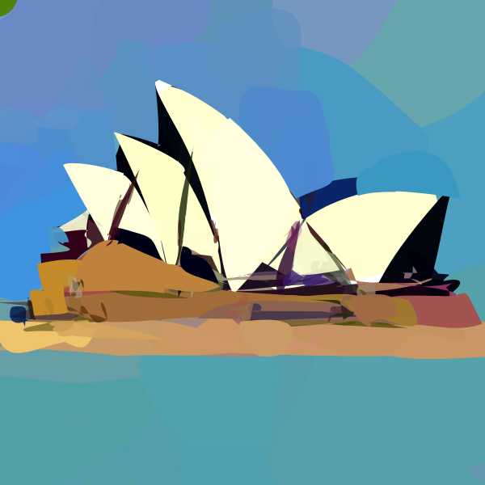 | 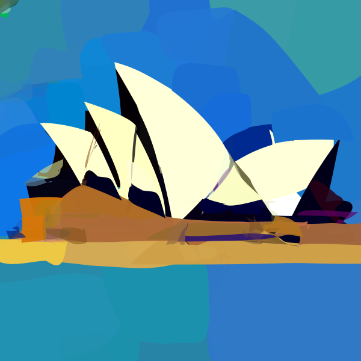 |  | 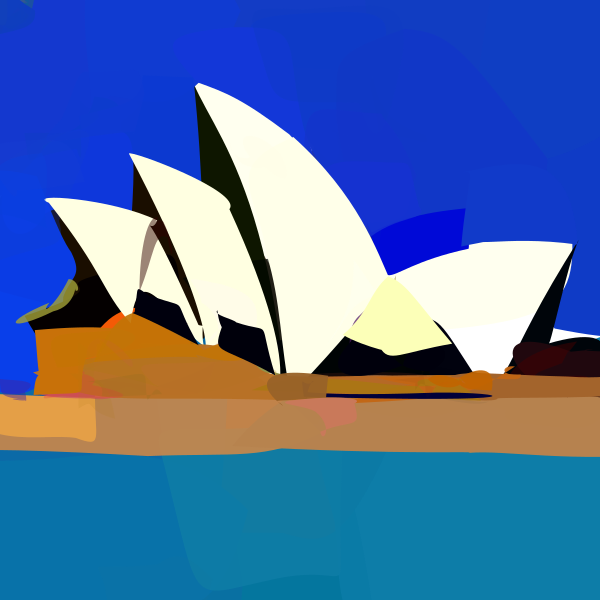 |  |

**Script:**

```shell
python run_painterly_render.py \ 
  -c vectorfusion.yaml \
  -pt "the Sydney Opera House. minimal flat 2d vector icon. lineal color. on a white background. trending on artstation" \
  -save_step 50 \ 
  -update "K=4" \ 
  -respath ./workdir/SydneyOperaHouse \
  -d 15486 \
  --download
```

- `-c` a.k.a `--config`: configuration file.
- `-save_step`: the step size used to save the result (**too frequent calls will result in longer times**).
- `-update`: a tool for editing the hyper-params of the configuration file, so you don't need to create a new yaml.
- `-pt` a.k.a `--prompt`: text prompt.
- `-respath` a.k.a `--results_path`: the folder to save results.
- `-d` a.k.a `--seed`: random seed.
- `--download`: download models from huggingface automatically **when you first run them**.

optional:

- `-npt`, a.k.a `--negative_prompt`: negative text prompt.
- `-mv`, a.k.a `--make_video`: make a video of the rendering process (**it will take much longer**).
- `-frame_freq`, a.k.a `--video_frame_freq`: the interval of the number of steps to save the image.
- `-framerate`, a.k.a `--video_frame_rate`: control the playback speed of the output video.

### Case: Ming Dynasty Vase

**Prompt:** A photo of a Ming Dynasty vase on a leather topped table. <br/>
**Style:** iconography <br/>
**Preview:**

| 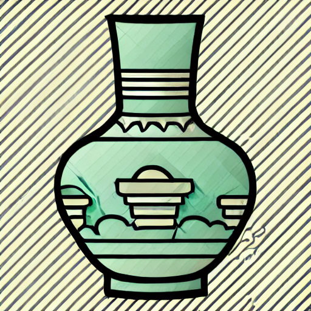 | 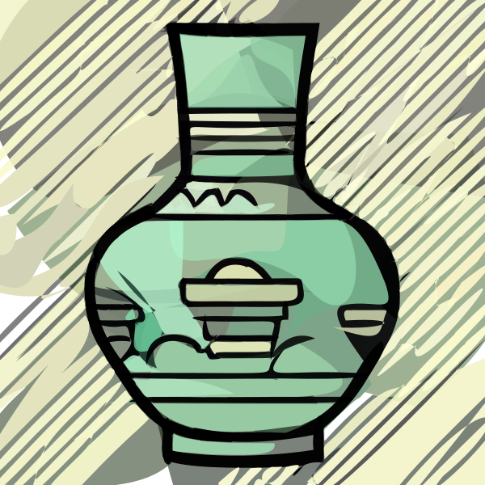 | 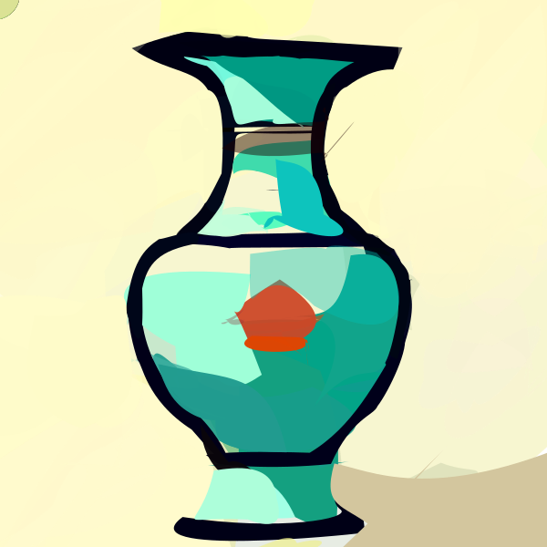 |
|---------------------------------------------------------------------------------|-------------------------------------------------------------------------------|-----------------------------------------------------------------------------------|
| (a) Sample raster image with Stable Diffusion                                   | (b) Convert raster image to a vector via LIVE                                 | (c) VectorFusion: Fine tune by LSDS                                               |

**Script:**

```shell
python run_painterly_render.py -c vectorfusion.yaml -pt "A photo of a Ming Dynasty vase on a leather topped table. minimal flat 2d vector icon. lineal color. on a white background. trending on artstation" -save_step 50 -respath ./workdir/vase -update "K=6" -d 683692
```

### Case: Sloth

**Prompt:** A smiling sloth wearing a leather jacket, a cowboy hat and a kilt. <br/>
**Style:** iconography <br/>
**Preview:**

| 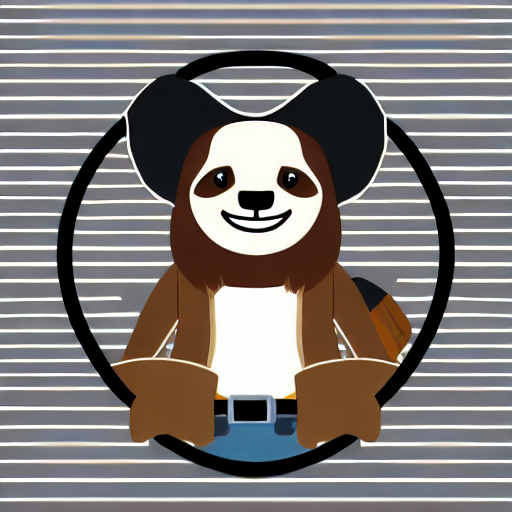 | 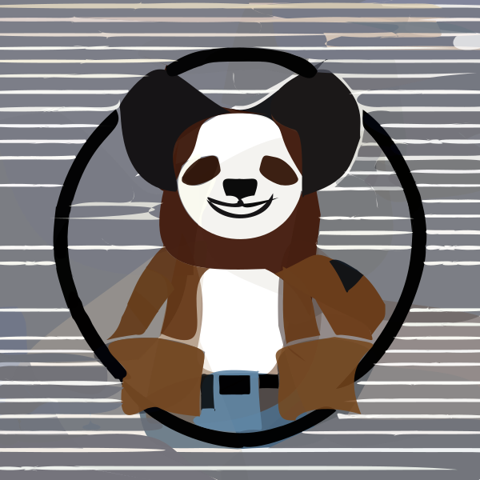 | 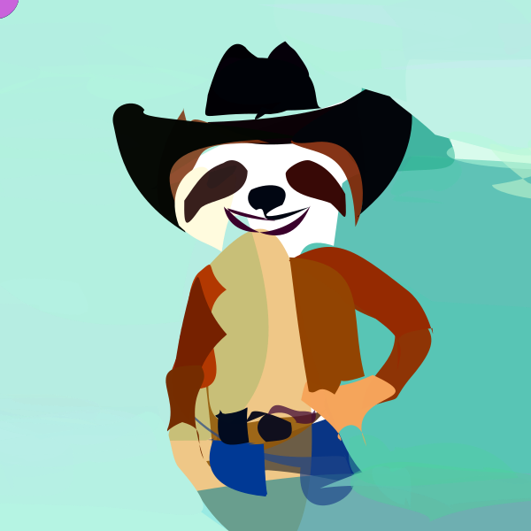 |
|------------------------------------------------------------------------------|----------------------------------------------------------------------------|--------------------------------------------------------------------------------|
| (a) Sample raster image with Stable Diffusion                                | (b) Convert raster image to a vector via LIVE                              | (c) VectorFusion: Fine tune by LSDS                                            |

**Script:**

```shell
python run_painterly_render.py -c vectorfusion.yaml -pt "A smiling sloth wearing a leather jacket, a cowboy hat and a kilt. minimal flat 2d vector icon. lineal color. on a white background. trending on artstation" -save_step 50 -respath ./workdir/sloth -update "K=6" -d 280328 
```

### Other Cases

```shell
# Pixel-Art style
CUDA_VISIBLE_DEVICES=0 python run_painterly_render.py -c vectorfusion.yaml -pt "A delicious hamburger. pixel art. trending on artstation" -save_step 50 -respath ./workdir/hamburger -update "style=pixelart" -rdbz
CUDA_VISIBLE_DEVICES=0 python run_painterly_render.py -c vectorfusion.yaml -pt "Electric guitar. pixel art. trending on artstation" -save_step 50 -respath ./workdir/guitar -update "style=pixelart" -rdbz
CUDA_VISIBLE_DEVICES=0 python run_painterly_render.py -c vectorfusion.yaml -pt "Pikachu. pixel art. trending on artstation" -save_step 50 -respath ./workdir/Pikachu -update "style=pixelart" -rdbz
# Sketch style
CUDA_VISIBLE_DEVICES=0 python run_painterly_render.py -c vectorfusion.yaml -pt "watercolor painting of a firebreathing dragon. minimal 2d line drawing. trending on artstation" -save_step 50 -respath ./workdir/dragon -update "style=sketch skip_live=True num_segments=5 radius=0.5" -rdbz
```

**More Examples:**

- check the [Examples.md](https://github.com/ximinng/VectorFusion-pytorch/blob/master/Examples.md) for more cases.

**More Scripts:**

- check the [Run.md](https://github.com/ximinng/VectorFusion-pytorch/blob/master/RUN.md) for more scripts.

## Acknowledgement

The project is built based on the following repository:

- [BachiLi/diffvg](https://github.com/BachiLi/diffvg)
- [huggingface/diffusers](https://github.com/huggingface/diffusers)
- [ximinng/DiffSketcher](https://github.com/ximinng/DiffSketcher)

We gratefully thank the authors for their wonderful works.

## Citation

If you use this code for your research, please cite the following work:

```
@inproceedings{jain2023vectorfusion,
  title={Vectorfusion: Text-to-svg by abstracting pixel-based diffusion models},
  author={Jain, Ajay and Xie, Amber and Abbeel, Pieter},
  booktitle={Proceedings of the IEEE/CVF Conference on Computer Vision and Pattern Recognition},
  pages={1911--1920},
  year={2023}
}

@inproceedings{
    xing2023diffsketcher,
    title={DiffSketcher: Text Guided Vector Sketch Synthesis through Latent Diffusion Models},
    author={XiMing Xing and Chuang Wang and Haitao Zhou and Jing Zhang and Qian Yu and Dong Xu},
    booktitle={Thirty-seventh Conference on Neural Information Processing Systems},
    year={2023},
    url={https://openreview.net/forum?id=CY1xatvEQj}
}
```

## Licence

This repo is licensed under a MIT License.