# Results

Here are some results.

## Iconography

### baseline: text-to-image-to-vector

- panda

```shell
CUDA_VISIBLE_DEVICES=0 python run_painterly_render.py \
-c vectorfusion.yaml \
-pt "a panda rowing a boat in a pond. minimal flat 2d vector icon. lineal color. on a white background. trending on artstation" \
-respath ./workdir/sd15/panda \
-update "model_id=sd15 image_size=600" \
-d 598522
```

You will get the following result:

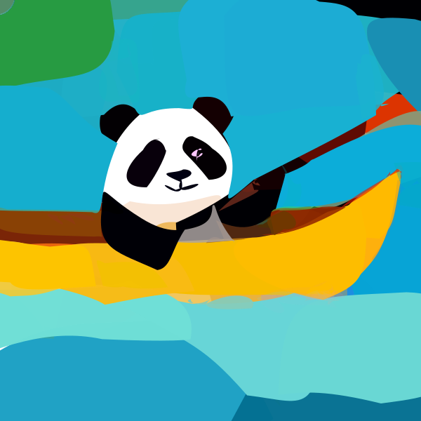

- boat

```shell
CUDA_VISIBLE_DEVICES=0 python run_painterly_render.py \
-c vectorfusion.yaml \
-pt "a boat. minimal flat 2d vector icon. lineal color. on a white background. trending on artstation" \
-respath ./workdir/sd15/boat \
-update "model_id=sd15 image_size=600" \
-d 79676
```

You will get the following result:

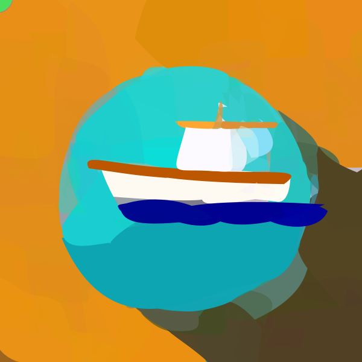

- temple

```shell
CUDA_VISIBLE_DEVICES=0 python run_painterly_render.py \
-c vectorfusion.yaml \
-pt "A 3D rendering of a temple. minimal flat 2d vector icon. lineal color. on a white background. trending on artstation" \
-respath ./workdir/sd15/temple \
-update "model_id=sd15 image_size=600" \
-d 16025
```

You will get the following result:

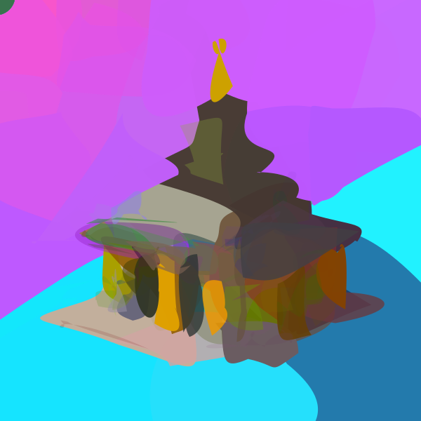

### from scratch

- panda

```shell
CUDA_VISIBLE_DEVICES=0 python run_painterly_render.py \
-c vectorfusion.yaml \
-pt "a panda rowing a boat in a pond. minimal flat 2d vector icon. lineal color. on a white background. trending on artstation" \
-respath ./workdir/sd15/panda \
-update "skip_live=True sds.num_iter=2000 path_reinit.stop_step=1500 path_reinit.area_threshold=0" \
-d 54091
```

You will get the following result:

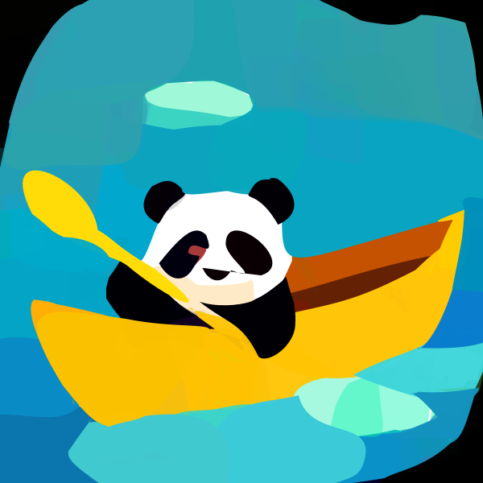

- boat

```shell
CUDA_VISIBLE_DEVICES=0 python run_painterly_render.py \
-c vectorfusion.yaml \
-pt "a boat. minimal flat 2d vector icon. lineal color. on a white background. trending on artstation" \
-respath ./workdir/sd15/boat \
-update "skip_live=True sds.num_iter=2000 path_reinit.stop_step=1500 path_reinit.area_threshold=0" \
-d 10630
```

You will get the following result:

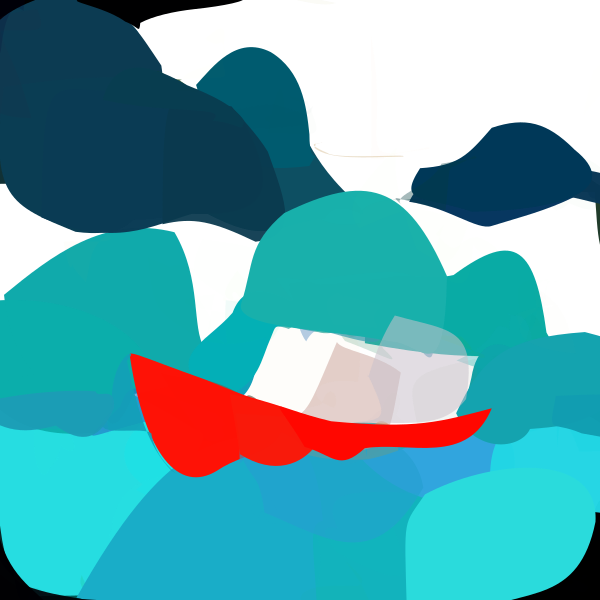

- temple

```shell
CUDA_VISIBLE_DEVICES=0 python run_painterly_render.py \
-c vectorfusion.yaml \
-pt "A 3D rendering of a temple. minimal flat 2d vector icon. lineal color. on a white background. trending on artstation" \
-respath ./workdir/sd15/temple \
-update "skip_live=True sds.num_iter=2000 path_reinit.stop_step=1500 path_reinit.area_threshold=0" \
-d 42
```

You will get the following result:

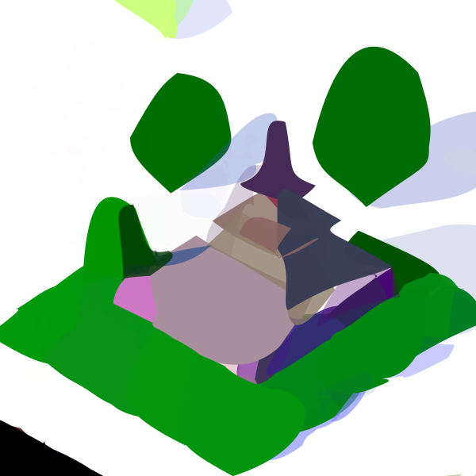

## Pixel

- panda

```shell
CUDA_VISIBLE_DEVICES=0 python run_painterly_render.py \
-c vectorfusion.yaml \
-pt "a panda rowing a boat in a pond. pixel art. trending on artstation." \
-respath ./workdir/sd15/panda \
-update "style=pixelart image_size=512" \
-d 29067
```

You will get the following result:


- boat

```shell
CUDA_VISIBLE_DEVICES=0 python run_painterly_render.py \
-c vectorfusion.yaml \
-pt "a boat. pixel art. trending on artstation." \
-respath ./workdir/sd15/boat \
-update "style=pixelart image_size=512" \
-d 52374
```

You will get the following result:

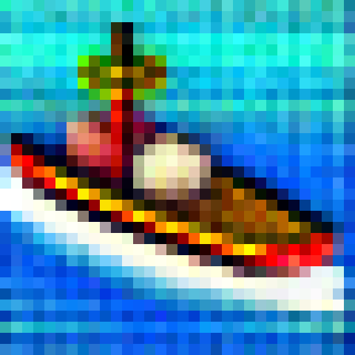

- temple

```shell
CUDA_VISIBLE_DEVICES=0 python run_painterly_render.py \
-c vectorfusion.yaml \
-pt "A 3D rendering of a temple. pixel art. trending on artstation." \
-respath ./workdir/sd15/temple \
-update "style=pixelart image_size=512" \
-d 62559
```

You will get the following result:

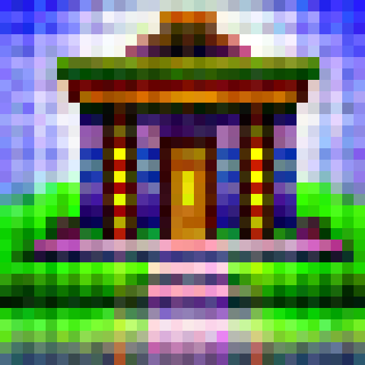

## Sketch

- panda

```shell
CUDA_VISIBLE_DEVICES=0 python run_painterly_render.py \
-c vectorfusion.yaml \
-pt "a panda rowing a boat in a pond. minimal flat 2d vector icon. minimal 2d line drawing. trending on artstation." \
-respath ./workdir/sd15/panda \
-update "style=sketch skip_live=True num_segments=5 radius=0.5" \
-d 44629
```

You will get the following result:

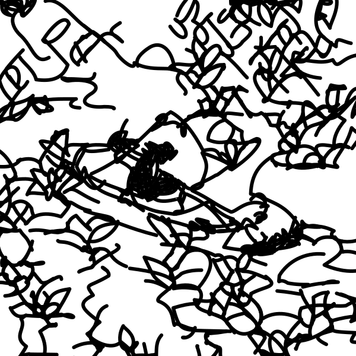

- boat

```shell
CUDA_VISIBLE_DEVICES=0 python run_painterly_render.py \
-c vectorfusion.yaml \
-pt "a boat. minimal flat 2d vector icon. minimal 2d line drawing. trending on artstation." \
-respath ./workdir/sd15/boat \
-update "style=sketch skip_live=True num_segments=5 radius=0.5" \
-d 62392
```

You will get the following result:

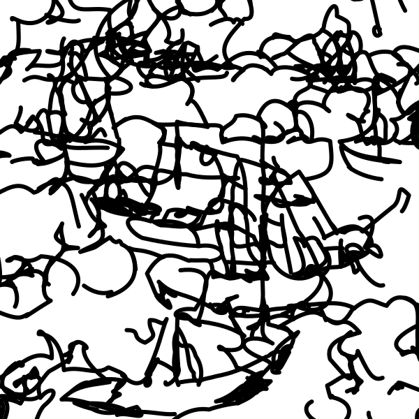

- temple

```shell
CUDA_VISIBLE_DEVICES=0 python run_painterly_render.py \
-c vectorfusion.yaml \
-pt "A 3D rendering of a temple. minimal flat 2d vector icon. minimal 2d line drawing. trending on artstation." \
-respath ./workdir/sd15/temple \
-update "style=sketch skip_live=True num_segments=5 radius=0.5" \
-d 31002
```

You will get the following result:

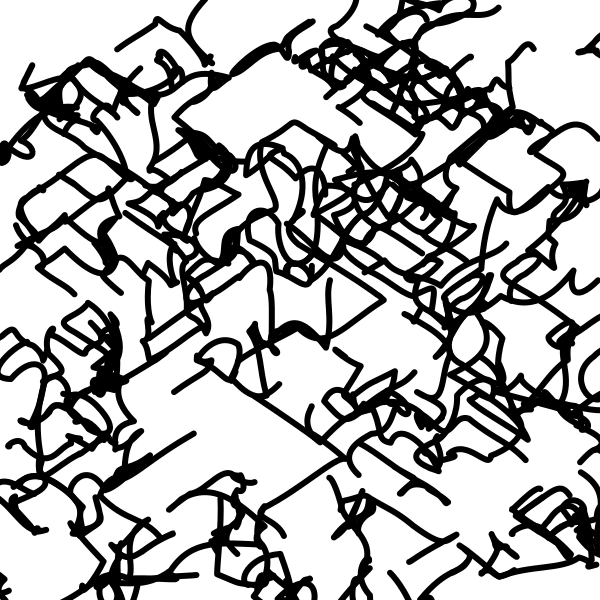